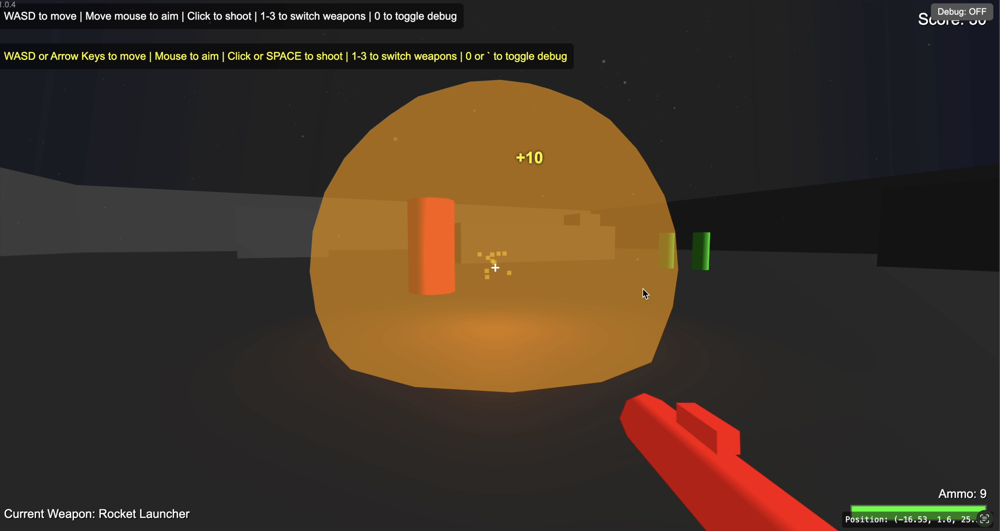

# Arena Shooter

A fast-paced, browser-based arena shooter inspired by classic games like Unreal Tournament 99.

## How to Play

1. Open `index.html` in a modern web browser (Chrome, Firefox, Safari, or Edge recommended)
2. Click the "Start Game" button to begin
3. Use your mouse to aim and WASD keys to move
4. Collect weapon pickups to gain access to more powerful weapons
5. Defeat enemies to earn points
6. Survive as long as possible!

## Controls

### Movement
- **W / Up Arrow**: Move forward
- **S / Down Arrow**: Move backward
- **A / Left Arrow**: Strafe left
- **D / Right Arrow**: Strafe right
- **Mouse**: Look/aim

### Combat
- **Left Mouse Button / Space**: Shoot
- **1**: Switch to Blaster (default weapon, infinite ammo)
- **2**: Switch to Shotgun (if you have ammo)
- **3**: Switch to Rocket Launcher (if you have ammo)

### Debug Mode
- **0 / ` (Backtick)**: Toggle debug mode
- **Debug Button**: Click the "Debug: OFF/ON" button in the top-right corner

## Weapons

### Basic Blaster
- Default weapon with infinite ammo
- Medium damage
- Medium fire rate
- Cyan projectiles

### Shotgun
- Fires multiple projectiles in a spread pattern
- Medium damage per projectile
- Slow fire rate
- Orange projectiles
- Limited ammo

### Rocket Launcher
- Fires explosive projectiles that damage enemies in a radius
- High damage
- Very slow fire rate
- Red projectiles
- Limited ammo

## Enemies

### Basic Enemy (Red)
- Medium health
- Medium speed
- Medium damage

### Fast Enemy (Green)
- Low health
- High speed
- Low damage

### Tank Enemy (Blue)
- High health
- Low speed
- High damage

## Debug Mode

Debug mode provides visual aids to help understand the game mechanics:

- **Red Line**: Shows your shooting direction
- **Colored Tracers**: Shows the path of your projectiles
- **Red Wireframe Spheres**: Shows enemy hit detection radius
- **Position Display**: Shows your current coordinates in the arena

## Tips

1. Keep moving to avoid enemy attacks
2. Use cover to protect yourself
3. The Rocket Launcher is effective against groups of enemies
4. The Shotgun is effective at close range
5. Collect weapon pickups as soon as they respawn
6. Enemies will respawn after being defeated

## Technical Details

This game is built using:
- HTML5
- CSS3
- JavaScript
- Three.js for 3D rendering

No installation or build process is required - simply open the HTML file in a browser to play.

## Credits

Created as a learning project for 3D browser-based game development.

## License

MIT License - Feel free to use, modify, and distribute this code for personal or commercial projects. 